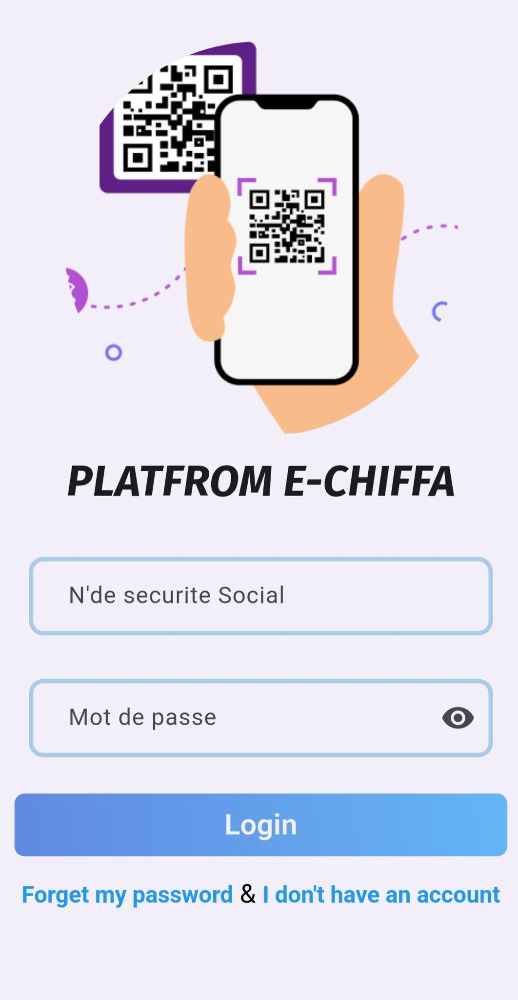

<!DOCTYPE html>
<html>
<head>

</head>
<body>

# E-chiFFa
$ cd backend  
$ docker build -t app  
$ docker-compose up -d  
$ docker run  app  
the base URL is  

BASE URL OF API : https://scps.onrender.com{ name of the servcie}

<a 
 href="https://www.postman.com/interstellar-space-608873/workspace/faciquest-api/collection/17242319-e4c5a61d-90b0-4238-9d69-ca2f92279cc9?action=share&creator=17242319&active-environment=17242319-f45eadeb-506b-4baf-9181-6a80af544625" 
 target="_blank">check api docs</a>

<h4>
web site:
</h4>
 

  

<h4>
mobile application:
</h4>
 

  

</body>
</html>

